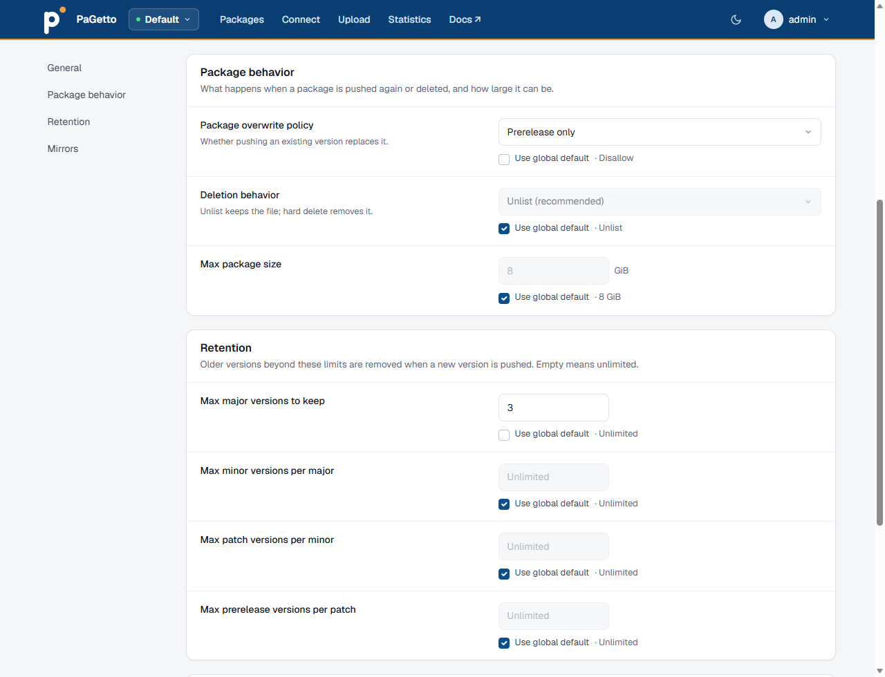
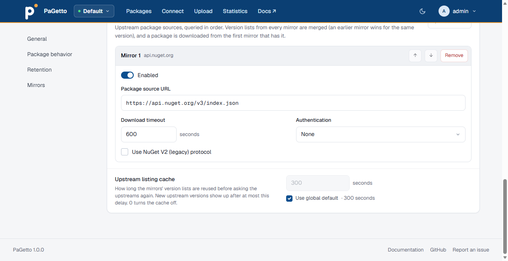

# Feeds

A **feed** is a separate package source inside one PaGetto server. Each feed has its own packages, its own settings (overwrites, deletion, retention, size limit, read-only mode), its own read-through mirror and its own permissions. Use feeds to keep, for example, `internal` packages apart from `experimental` ones, or to give each team a mirror of nuget.org with different rules.

## Feed URLs

Every feed has a **slug**, and its NuGet v3 endpoints live under `/feeds/{slug}/`:

| Feed | Service index |
|---|---|
| Default feed (slug `default`) | `https://your-server/v3/index.json` |
| Any other feed, e.g. `internal` | `https://your-server/feeds/internal/v3/index.json` |

All endpoints (search, registrations, package content, push, delete, symbols) work under the feed prefix, so a client only needs the service index URL. The web UI works the same way: `https://your-server/feeds/internal/` lists that feed's packages.

The **default feed** is created on first start and can't be deleted. Its URLs are the ones PaGetto has always used, so clients configured before multi-feed support keep working.

## Managing feeds

Feeds are managed by administrators on **Admin > Feeds**. This needs `Authentication:Mode` set to `Local`, `Entra` or `Hybrid` (see [Authentication](authentication.md)). The `Legacy` mode has no administrators, so only the default feed exists.

- **Create** a feed with **New feed**: a slug, a display name (at most 256 characters) and an optional description (at most 4000 characters). A slug is lowercase letters, digits and hyphens, can't start or end with a hyphen, and is at most 128 characters. It becomes part of the URL, so choose it with care.
- **Reorder** feeds by dragging them. The order is used wherever feeds are listed in the UI.
- Open a feed's **Settings** to change its display name, description and [settings](#feed-settings).
- **Delete** a feed with its trash button. This deletes all of its packages from the database and storage. It can't be undone.

There is also a small JSON API at `/api/v1/feeds`. It only accepts the web UI's sign-in cookie, so it is meant for administrators signed in to the web UI; personal access tokens and Basic auth don't work there.

| Request | Effect |
|---|---|
| `GET /api/v1/feeds`, `GET /api/v1/feeds/{slug}` | List all feeds, or get one |
| `POST /api/v1/feeds` | Create a feed from `slug`, `name` and `description` |
| `PUT /api/v1/feeds/{slug}` | Change only the `name` and `description` |
| `DELETE /api/v1/feeds/{slug}` | Delete the feed and its packages. The default feed returns `409 Conflict` |

Settings, mirrors and the feed order can only be changed in the web UI. Changes made through the API are not written to the [audit log](configuration.md#audit-log).

## Feed settings

Open **Admin > Feeds > Settings** for a feed (`/Admin/Feeds/{slug}/Settings`). Each setting has a **Use global default** checkbox: while it is checked, the feed follows the value from [configuration](configuration.md); uncheck it to override the value for this feed only.



| Setting | Global setting | Description |
|---|---|---|
| Read-only mode | `IsReadOnlyMode` | Reject pushes, unlists, deletes and relists on this feed, from NuGet clients and from the web UI |
| Package overwrite policy | `AllowPackageOverwrites` | Disallow (recommended), prerelease only, or allow all. See [package overwrites](configuration.md#enable-package-overwrites). |
| Deletion behavior | `PackageDeletionBehavior` | Unlist (recommended) or hard delete. See [hard deletions](configuration.md#enable-package-hard-deletions). |
| Max package size (GiB) | `MaxPackageSizeGiB` | Largest package or symbol package this feed accepts, at least 1. It can only lower the global value, which caps every request; larger pushes get `413 Payload Too Large` |
| Retention | `Retention` | How many major versions, minor versions per major, patch versions per minor and prerelease versions per patch to keep, each 0 or more. `0` keeps none of them except the version being pushed. An override left empty falls back to the global value. See [auto-deletion](configuration.md#package-auto-deletion). |
| Upstream listing cache (seconds) | `UpstreamListingCacheSeconds` | How long mirrored version lists are reused before asking the upstreams again. See [upstream listing cache](#upstream-listing-cache). |

:::tip

Set the values you want for most feeds in configuration, and override only where a feed differs. Changing a global value then updates every feed that still uses the default.

:::

## Mirror (read-through cache)

A feed can mirror an upstream NuGet feed, for example nuget.org. When a client asks the feed for a package it doesn't have, PaGetto fetches it from the upstream source, stores it in the feed and serves it. Later restores are served locally, which speeds up builds and keeps them working when the upstream is unreachable.

Mirrors are listed on each feed's settings page, under **Mirrors**. Use **Add mirror** to add one; each mirror has these settings:

| Setting | Description |
|---|---|
| Enabled | Use this mirror. Clear it to pause a mirror without losing its settings |
| Package source URL | The upstream service index, e.g. `https://api.nuget.org/v3/index.json`. Must be an absolute `http` or `https` URL |
| Use NuGet V2 (legacy) protocol | For upstream servers that only speak the V2 protocol |
| Download timeout (seconds) | How long to wait for an upstream download, at least 1. Leave it empty for the default of 600 seconds |
| Authentication | None, Basic (username and password), Bearer token or Custom headers (JSON, e.g. `{"X-Api-Key":"value"}`) |

Password and token fields are write-only: leave them blank to keep the stored value.

Custom headers must be a JSON object. The headers `Authorization`, `Cookie`, `Host`, `Content-Length`, `Transfer-Encoding`, `Connection`, `Upgrade`, `Proxy-Authorization` and `Set-Cookie` are refused; use Basic or Bearer authentication instead of an `Authorization` header. If any value on the settings page is invalid, nothing is saved. Changes to a mirror's password or token are written to the [audit log](configuration.md#audit-log) as `feed_mirror_credentials_changed`.



:::warning

Upstream credentials are stored in the PaGetto database. Restrict access to the database and its backups, and use a read-only token for the upstream feed where possible.

:::

### Multiple mirrors

A feed can mirror several upstreams, in order. This is useful when packages live in different places, for example open source packages on nuget.org and licensed packages on a vendor's private feed:

1. `https://api.nuget.org/v3/index.json`
2. `https://nuget.vendor.example/v3/index.json` (Basic authentication)

Developers then add only the PaGetto feed to `nuget.config`, and the vendor credentials stay on the server.

With more than one enabled mirror, PaGetto:

- **Merges version lists and metadata** from every mirror, so a package that exists on both upstreams shows the versions of both. When the same version exists on several mirrors, the earlier mirror's metadata wins.
- **Downloads from the first mirror that has the package**, and caches it in the feed. The package records which upstream it came from.
- **Skips a failing mirror**: an upstream that is unreachable or returns an error is logged and skipped, and the next mirror is tried.

Use the arrow buttons to change the order and **Remove** to delete a mirror, then **Save settings**. With a single enabled mirror, the feed behaves exactly as it did before multiple mirrors existed.

Put the upstream that has most of your packages first: version lists query every mirror, but a download stops at the first mirror that has the package.

### Upstream listing cache

A restore asks the feed for the version list and metadata of every package, and for a mirrored feed each of those requests also goes to the upstream, even when the package is already stored locally. With many build agents this adds up to thousands of upstream calls per restore, which is slow and can hit upstream rate limits (private feeds, Azure Artifacts, GitHub Packages).

PaGetto therefore keeps each upstream listing in memory for a short time, per feed and package id. Set the duration on the feed's settings page with **Upstream listing cache**, below the mirror list, or globally with `UpstreamListingCacheSeconds`:

```json
{
    ...

    "UpstreamListingCacheSeconds": 300,

    ...
}
```

- The default is `300` (5 minutes). `0` turns the cache off, so every request asks the upstreams again.
- With several mirrors, the merged listing of all mirrors is cached.
- Only listings that found the package are cached. When no upstream has the package, or an upstream fails, the next request asks again.
- Concurrent requests for a package that is not cached share one upstream call, so a burst of restores (for example many build agents starting at once, or the moment an entry expires) queries each upstream once per package instead of once per request. A client that disconnects stops waiting, but the shared call continues for the others until the upstream answers or times out.
- Package downloads are not cached here: a downloaded package is stored in the feed and served locally from then on.
- Saving the feed's settings (for example adding, removing or reordering a mirror) invalidates the feed's cached listings.
- The cache lives in the memory of each PaGetto instance and is empty after a restart.

The tradeoff is freshness: a version newly published to an upstream shows up in this feed with a delay of up to the cache duration. Lower the value, or set it to `0`, for a feed where new upstream versions must be visible immediately.

:::info

The global `Mirror` configuration section is obsolete. It is only read once, on the first start, to fill in the default feed's mirror settings. After that, edit mirrors per feed in **Admin > Feeds**.

:::

## Permissions

With `Authentication:Mode` set to `Local`, `Entra` or `Hybrid`, access to each feed is controlled by **pull**, **push** and **delete** permissions, granted to groups on **Admin > Groups & permissions**. Administrators can do everything on every feed. Feeds a user can't pull from are hidden from them. See [Feed permissions](authentication.md#feed-permissions).

With the `Legacy` mode there are no per-feed permissions: the configured API keys and credentials apply to all feeds.

## Connecting a client

Each feed has a **Connect** page (`/feeds/{slug}/Connect`, or the **Connect** link while browsing the feed) that shows its service index URL and how to authenticate.

With the dotnet CLI:

```shell
dotnet nuget add source "https://your-server/feeds/internal/v3/index.json" --name internal
dotnet nuget push -s internal -k <api-key-or-token> MyPackage.1.0.0.nupkg
```

Or in a `nuget.config` next to your solution:

```xml
<?xml version="1.0" encoding="utf-8"?>
<configuration>
  <packageSources>
    <clear />
    <add key="internal" value="https://your-server/feeds/internal/v3/index.json" />
    <add key="mirror" value="https://your-server/v3/index.json" />
  </packageSources>
  <packageSourceCredentials>
    <internal>
      <add key="Username" value="build-agent" />
      <add key="ClearTextPassword" value="%PAGETTO_TOKEN%" />
    </internal>
  </packageSourceCredentials>
</configuration>
```

Which username and password to use depends on the [authentication mode](authentication.md#using-pagetto-from-nuget-clients). Keep secrets out of source control: reference an environment variable as above, or add the credentials with `dotnet nuget update source … --username … --password …` on each machine.

The service index advertises a readme resource (`ReadmeUriTemplate`), so Visual Studio (with NuGet 6.13 or later) shows package readmes in the package manager.
