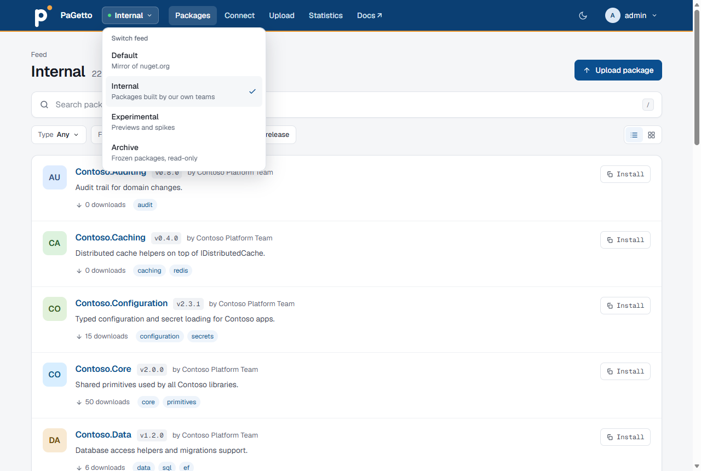
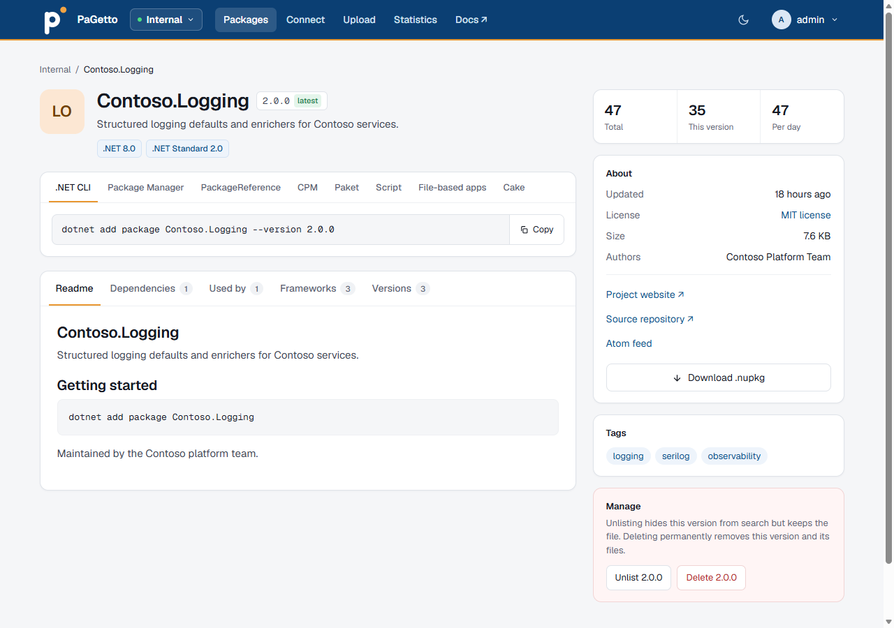
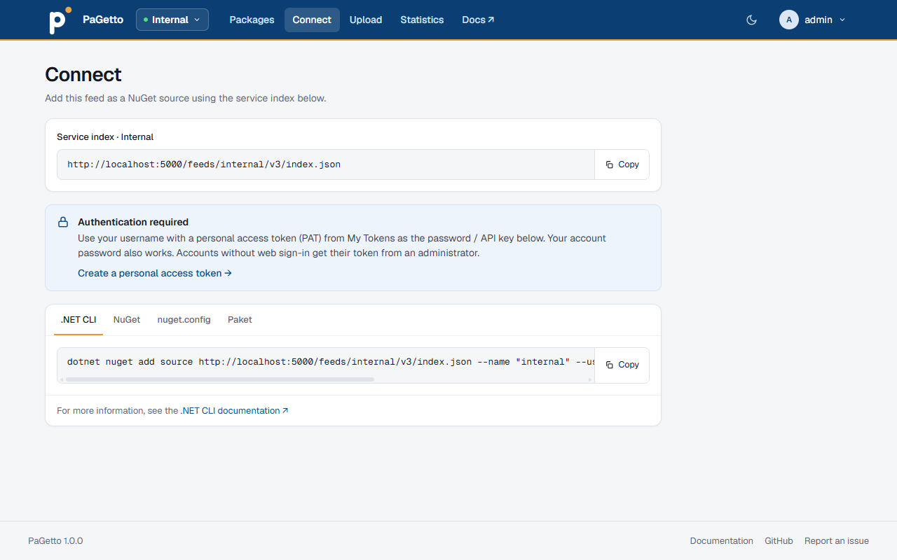
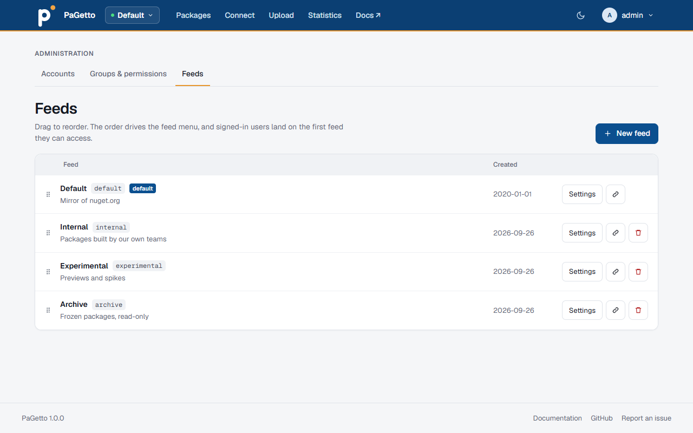
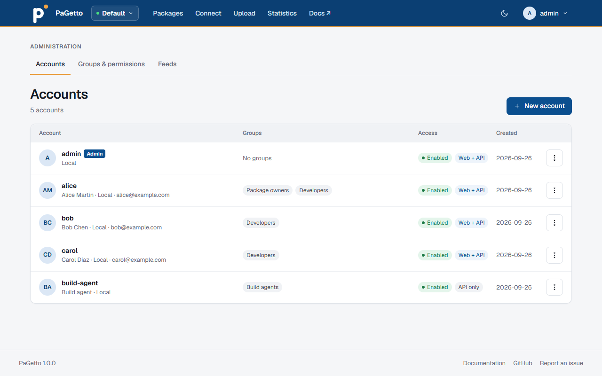
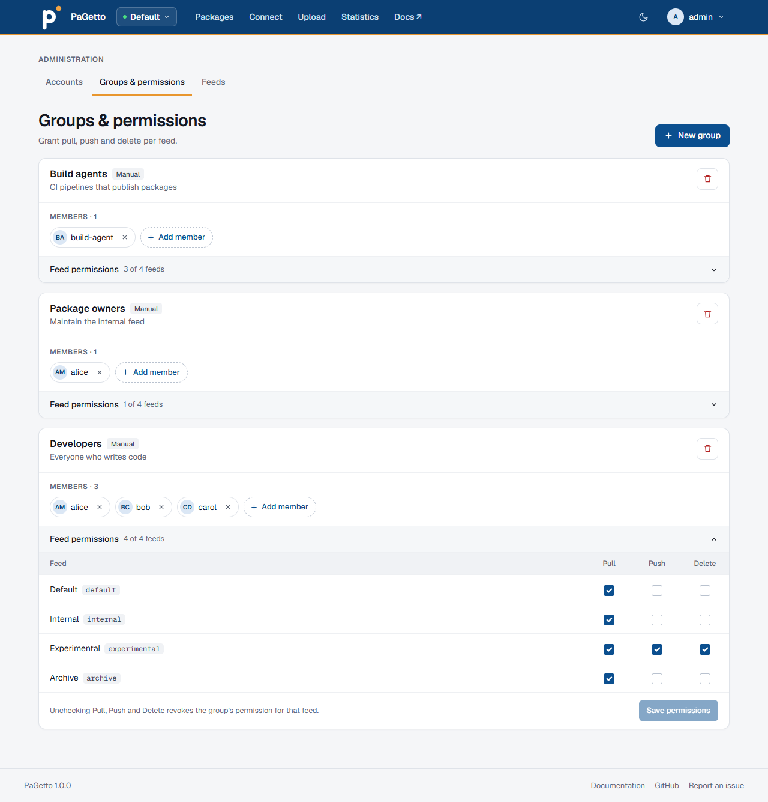

# Web UI

PaGetto has a web UI for browsing packages, connecting clients, uploading packages and managing the server. Open the server's root URL (`https://your-server/`) for the default [feed](feeds.md), or `https://your-server/feeds/{slug}/` for another feed.

What a user sees depends on their [permissions](authentication.md#feed-permissions). In the `Local`, `Entra` and `Hybrid` modes, users sign in with **Sign in** in the top bar, and anonymous visitors see a **Sign in required** page. Feeds a user can't pull from are hidden, and a signed-in user who can't pull from any feed sees **No feeds available**.

## Navigation

The top bar shows these items for the current feed:

| Item | Shown when | Contents |
|---|---|---|
| Feed switcher | The user can pull from more than one feed | Jumps to another feed. Feeds are listed in the order set on **Admin > Feeds**, each with its description |
| Packages | Always | The package list and search |
| Connect | The user can pull from the feed | The feed's service index URL and how to authenticate |
| Upload | The user can push to the feed | Upload from the browser, and commands to publish packages |
| Statistics | The page is [enabled](configuration.md#statistics) and the user can pull from the feed | Counts, downloads, stored size and the most downloaded and recently published packages |

A **Docs** link opens this documentation. Signed-in users also get a user menu with **My Tokens** and **Sign out**, and administrators find the **Accounts**, **Groups** and **Feeds** admin pages there.

The button next to the user menu switches between the light and the dark theme. Until you pick one, the UI follows the system setting; your choice is remembered per browser. On screens narrower than 760 px, the links and the user menu move into a menu behind the menu button.

In the `Local`, `Entra` and `Hybrid` modes, a signed-in user who opens the root URL lands on the first feed, in the order set on **Admin > Feeds**, that they can pull from. A user who opens a feed they can't pull from is sent to that feed as well.

## Search and filters

The **Packages** tab lists the feed's packages, 20 per page, with numbered pages at the bottom. Type in the search box to search the feed (press `/` on any page to jump to it), and narrow the list with the filters below it. The search is case-insensitive and matches the package id, title, description, authors and tags (a tag matches when it starts with the search term). Id matches are listed first: exact, then prefix, then anywhere in the id. NuGet clients (`dotnet package search`, the Visual Studio browse tab) get the same results.

| Filter | Effect |
|---|---|
| Type | Dependencies, .NET tools or .NET templates |
| Framework | Only packages that support the chosen target framework |
| Tag | Only packages with the chosen tag. Type in the dropdown to find a tag |
| Prerelease | Show or hide prerelease versions |

The filter values come from the packages in the current feed, so each feed offers only its own frameworks and tags.

The buttons at the end of the filter row switch between a list and a grid view; the choice is remembered per browser. Each package has an **Install** button that copies its install command (the first snippet on the package page). On screens narrower than 760 px (phones) the list view hides it; switch to the grid view to use it there.

Users who can delete from the feed also see unlisted packages in the list, so they can find and relist them. Everyone else only sees listed packages, as NuGet clients do.

## Package page

A package page shows:

- Badges for the lowest target framework per family (for example ".NET 6.0" and ".NET Standard 2.0"; the package works on that framework or higher), and a **Frameworks** tab with every target framework.
- Install snippets in tabs, with a **Copy** button: .NET CLI, Package Manager console, `PackageReference`, Central Package Management, Paket CLI, `#r` for scripts and notebooks, `#:package` for file-based apps, and Cake. .NET tools get global and local install commands, and .NET templates a single .NET CLI tab with `dotnet new --install {id}::{version}`.
- Notes for prerelease versions, a minimum NuGet client version and required license acceptance, and the package's title and summary when they differ from the id.
- The readme (or the description when there is none) on the **Readme** tab, and the release notes on the **Release notes** tab when the package has them.
- Dependencies grouped by target framework on the **Dependencies** tab, and up to 20 packages in this feed that depend on it on the **Used by** tab (not shown for .NET tools and templates).
- The version history on the **Versions** tab, with dates, and an **Include prerelease** switch when there are prereleases. It shows the newest 5 versions until you select **Show all N versions**. The version you are viewing is marked **current** there, and the heading of the page marks it **latest** when it is the newest listed stable version. Versions stored in the feed have a downloads bar and a **Download** link; mirror-only versions have neither. Unlisted versions are only listed for users with the **Delete** permission. On a feed with a [mirror](feeds.md#mirror-read-through-cache), versions that are only available from the mirror are marked **mirror**; they are stored in the feed the first time someone downloads them. A link to a version that doesn't exist says so instead of showing another version.
- In the sidebar, the total downloads, the downloads of the shown version and the average per day since the first version was stored in the feed.
- An **About** card with the last update, the license (named after the license expression, e.g. "MIT license", when the package has one), the size, the authors, links to the project website and source repository, the copyright, and a **Download .nupkg** button. Packages stored before PaGetto recorded copyright, license expression and size get them from a one-time background task after the upgrade, which re-reads their stored `.nupkg`.
- A link to the package's [Atom feed](#atom-feed), in the **About** card.
- A **Tags** card; a tag opens the package list filtered by that tag.

### Atom feed

Every package has an Atom feed of its listed versions, newest first (at most 20), at `/packages/{id}/atom.xml`, or `/feeds/{slug}/packages/{id}/atom.xml` for a named feed. The package page links to it, so feed readers can find it from the page URL. Versions that are only available from a mirror are included, unlisted versions aren't.

Feed readers can't use the web UI's sign-in. In the `Local`, `Entra` and `Hybrid` modes they authenticate with Basic auth: your user name and a [personal access token](#my-tokens) as the password. Users without pull permission on the feed get a 404, as on the package page.

## Unlist, relist and delete

Users with the **Delete** permission on the feed can manage versions on the package page, in the **Manage** section of the sidebar. Unlist and delete ask for confirmation first:

- **Unlist** (the button names the version, e.g. **Unlist 2.0.0**) hides a version from search and listings, but keeps it. Clients that already reference that exact version can still restore it.
- **Relist** makes an unlisted version visible again. Unlisted versions are struck through on the **Versions** tab and marked **unlisted**, with a **Relist** link; only users with the **Delete** permission see them. While you view an unlisted version, the **Manage** section offers only **Delete**; relist it from the **Versions** tab.
- **Delete** (e.g. **Delete 2.0.0**) permanently removes the version and its files, whatever the feed's [deletion behavior](feeds.md#feed-settings) is. It can't be undone.

On a feed in [read-only mode](feeds.md#feed-settings) the **Manage** section and the **Relist** links are hidden, and the actions are refused. The same goes for versions that are only available from a mirror.

The feed's deletion behavior only applies to deletes from NuGet clients (`dotnet nuget delete`). The actions on the package page are written to the [audit log](configuration.md#audit-log) as `package_unlist_*`, `package_relist_*` and `package_delete_*` lines, and so are all changes on the **Admin** pages.

## Connect

The **Connect** tab shows the feed's service index URL with a copy button, and explains how to authenticate for the server's [authentication mode](authentication.md#authentication-modes): which user name and password or token to use, with commands for the .NET CLI, the NuGet CLI, `nuget.config` and Paket. In the `Local`, `Entra` and `Hybrid` modes, users must sign in to see it. See also [Connecting a client](feeds.md#connecting-a-client).

## Upload

The **Upload** tab publishes packages to the current feed. It only appears for users who can push to the feed, and opening it directly without push permission returns 404.

**Upload from browser** takes `.nupkg` and `.snupkg` files, several at a time: pick them with **browse** or drop them on the card. Before anything is sent, each file shows a preview read from its `.nuspec`: id, version, authors, license, description and the dependencies per target framework. The preview also warns when:

- the version already exists in the feed, or will replace the existing one if the feed [allows overwrites](configuration.md#enable-package-overwrites)
- the package of a symbol package isn't in the feed yet
- a file is larger than the feed's [size limit](configuration.md#maximum-package-size)

**Upload** then sends the files one at a time, packages before symbol packages, and shows a progress bar, the result and a link to the published package for each.

Browser uploads follow the same rules as `dotnet nuget push`: the push permission, the feed's [read-only mode](configuration.md#read-only-mode), its size limit and duplicate versions. They also write the same [audit](configuration.md#audit-log) lines. In the `Legacy` [authentication mode](authentication.md#authentication-modes), the card asks for the API key when one is configured. On a read-only feed, a note replaces the card.

Below the card, the tab shows the commands to publish with the .NET CLI, the NuGet CLI, Paket and PowerShellGet.

## Statistics

The **Statistics** tab (`/stats`, or `/feeds/{slug}/stats`) shows, for the current feed, how many packages and versions it has (with the unlisted, stable and prerelease counts), the total downloads, the stored size of the package files, the server version, and lists of the 10 most downloaded and the 10 most recently published packages. When `Statistics:ListConfiguredServices` is `true` (as in the shipped `appsettings.json`), it also lists the database and storage in use. Turn the page off with `Statistics:EnableStatisticsPage`, see [Statistics](configuration.md#statistics). The page returns `404` when it is turned off, and to signed-in users without pull permission on the feed.

## My Tokens

**My Tokens** in the user menu lists the signed-in user's [personal access tokens](authentication.md#personal-access-tokens-pats), and lets them create (**Create token**) and revoke (**Revoke**) tokens. A new token is shown only once. The page is available to Entra and local users; administrators create tokens for local accounts without web sign-in on **Admin > Accounts**.

## Administration

Administrators open these pages from the user menu. They share a tab row, so you can switch between them:

| Page | Contents |
|---|---|
| Accounts | Create, enable and disable [local accounts](authentication.md#local-accounts), allow or block web sign-in, make or remove administrators, unlock locked accounts, reset passwords, create tokens, and see Entra users who have signed in. A disabled account can be deleted. Each row shows whether the account is Local or Entra, its email address, and its groups: role-synced groups and manual memberships have different chips |
| Groups & permissions | Manage [groups](authentication.md#groups), their members, and their [permissions](authentication.md#feed-permissions) on each feed |
| Feeds | Create, reorder and delete [feeds](feeds.md#managing-feeds), copy each feed's service index URL, and open each feed's [settings](feeds.md#feed-settings) (including its display name, description and mirrors) |
| Audit log | The successful package actions and administration changes, with who made them, when and from which IP address |

### Feeds

Drag a feed by its handle to change the order. The order is saved right away, and is used by the feed switcher and to pick the feed a user lands on.

### Accounts

**New account** opens the form for a local account. The other actions are in the **Actions** menu (⋮) at the end of each row; **Edit account…**, **Reset password…**, **New token…** and **Delete account…** open a dialog. Entra accounts only have the enable, web sign-in and delete actions. See [Local accounts](authentication.md#local-accounts).

### Groups & permissions

**New group** opens the form for a group, with an optional **App role value** that links it to an Entra app role; it can't be changed afterwards. The pencil button next to a group edits its name and description; members, permissions and the app role link are kept. Add members to a group with **Add member**, and remove one with the x on its chip. Entra users can't be added to or removed from a role-linked group by hand: their membership follows their app roles. **Delete group** removes the group with its memberships and permissions. Open **Feed permissions** under a group to set its **Pull**, **Push** and **Delete** permissions on each feed, then select **Save permissions**; the button is enabled once a box changes. Clearing all three removes the group's access to that feed.

### Audit log

**Audit log** lists the successful package uploads, unlists, relists and deletes, from NuGet clients and from the web UI, and every change on the **Admin** pages, newest first and 50 per page. Each row shows the time in UTC, the [event](configuration.md#audit-log), the actor, the target (the account, group or feed that was changed, or the package id and version with its feed), the detail and the client IP address. Filter by event, actor, feed, target or package id, and a range of days in UTC. Denied and failed attempts are only in the server log. Events are kept for `Audit:RetentionDays` days, 30 by default (see [Audit retention](configuration.md#audit-retention)).
