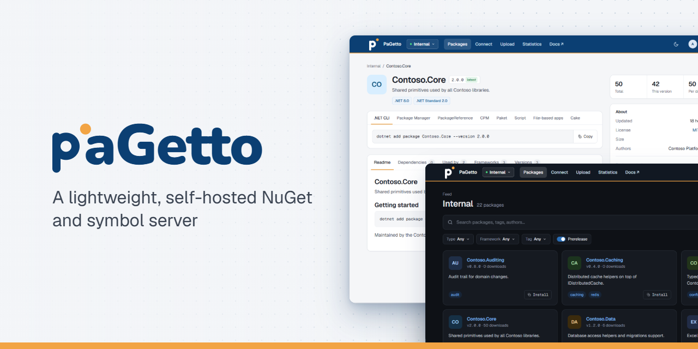

A lightweight [NuGet] and [symbol] server written in C#: self-hosted, cross-platform and cloud ready.

PaGetto is based on [BaGetter]. It has a redesigned web UI, a reworked code base and new features such as multiple feeds, user and permission management, and Microsoft Entra ID sign-in. Coming from BaGetter? The [migration guide][Migration] shows how to move an existing installation over.

[![CI][CI badge]][CI link] [![Release][Release badge]][Release link] [![Docker][Docker badge]][Docker link] [![Docs][Docs badge]][Documentation]

## 📦 Features

* **Multiple feeds**: each feed has its own packages, settings, retention and read-through mirror, under `/feeds/{slug}/v3/index.json`.
* **Users & permissions**: `Local`, `Entra` or `Hybrid` authentication, groups, per-feed pull/push/delete permissions, and personal access tokens with expiry email reminders.
* **Admin UI** for feeds, accounts and groups.
* **Offline support**: [mirror nuget.org or any other feed][Read through caching] per feed.
* **Pluggable backends**: SQLite, SQL Server, PostgreSQL or MySQL; the file system, Azure Blob, AWS S3, Google Cloud Storage, Aliyun OSS or Tencent COS.
* **Runs anywhere**: Windows, Linux and macOS, x64 and ARM64, Docker, Kubernetes (Helm) or IIS.

## 🚀 Getting started

**Docker**

```bash
docker run -d -p 5000:8080 -v pagetto-data:/data letreset/pagetto:latest
```

Then browse to `http://localhost:5000/`.

**Kubernetes**

```bash
helm install pagetto oci://ghcr.io/letreset/charts/pagetto --version <version>
```

**.NET / IIS**

1. Install the [ASP.NET Core 10 runtime] (for IIS, the [hosting bundle]).
2. Download and extract `pagetto-<version>.zip` from the [latest release][Release link].
3. Run `dotnet PaGetto.dll`, or point an IIS site at the extracted folder.

See the [documentation] for configuration, authentication and cloud deployments.

## 🛠️ Development

```bash
dotnet build
dotnet test
dotnet run --project src/PaGetto
```

Releases are cut by pushing a `vX.Y.Z` tag on `main`. Each release publishes the zip, the Docker image and the Helm chart, with a generated changelog. The roadmap is tracked in [GitHub issues][Issues].

## 📄 License

[MIT](LICENSE).

[NuGet]: https://learn.microsoft.com/nuget/what-is-nuget
[symbol]: https://learn.microsoft.com/windows/win32/debug/symbol-servers-and-symbol-stores
[BaGetter]: https://github.com/bagetter/BaGetter
[ASP.NET Core 10 runtime]: https://dotnet.microsoft.com/download/dotnet/10.0
[hosting bundle]: https://dotnet.microsoft.com/permalink/dotnetcore-current-windows-runtime-bundle-installer
[Documentation]: https://letreset.github.io/PaGetto/
[Migration]: https://letreset.github.io/PaGetto/docs/migrating-from-bagetter
[Read through caching]: https://letreset.github.io/PaGetto/docs/configuration#enable-read-through-caching
[Issues]: https://github.com/letreset/PaGetto/issues

[CI badge]: https://img.shields.io/github/actions/workflow/status/letreset/PaGetto/ci.yml?branch=main&logo=github&label=CI
[CI link]: https://github.com/letreset/PaGetto/actions/workflows/ci.yml
[Release badge]: https://img.shields.io/github/v/release/letreset/PaGetto?logo=github&sort=semver
[Release link]: https://github.com/letreset/PaGetto/releases
[Docker badge]: https://img.shields.io/docker/v/letreset/pagetto?logo=docker&logoColor=fff&label=docker&sort=semver
[Docker link]: https://hub.docker.com/r/letreset/pagetto
[Docs badge]: https://img.shields.io/badge/docs-GitHub%20Pages-blue
